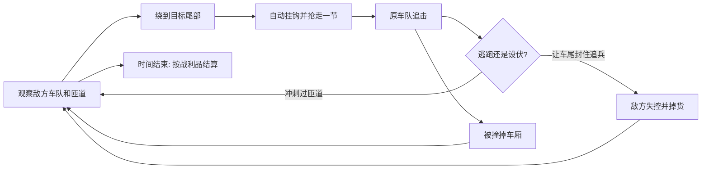

# 《车队劫持》开发计划

> 工作名：**车队劫持 / Convoy Heist**  
> 类型：手机优先的俯视角街机追逐游戏  
> 目标平台：Poki Web  
> 文档状态：概念已收敛，等待垂直切片验证

## 1. 要解决的问题

现有《拖车大逃亡》原型证明了两件事：拖车变长有画面感，手机摇杆加冲刺也能正常操作；但“捡静止货物、凑数量、去出口”的循环不够有趣。车队变长主要增加操控负担，搬运车和冲刺只是附加事件，不能让玩家持续产生新的决策。

因此不再给现有仓库原型增加地图、数值或敌人。它保留为操作和拖车跟随的技术参考；正式方向改为动态的**抢、护、截**循环。

## 2. 一句话与玩家幻想

在不断封路的夜间高架上，抢走敌方车队的最后一节货车；拉着越来越长的战利品甩开追兵，反过来用自己的车队封住他们。

玩家不是在收集地图上的物品，而是在劫持一支活着、会逃跑、会反击的车队。

## 3. 三条必须成立的设计原则

1. **每节拖车既是财富，也是武器。** 长车队更值钱，也能拦截敌方车；但更难带过匝道，更容易被抢。
2. **每次抢夺都改变场面。** 抢到车厢后，原主人进入追击状态；玩家立刻需要逃、绕路或设伏，不能继续沿固定路线收集。
3. **画面先于文字解释规则。** 敌方车尾的挂钩、追击警报、掉落的货物、能封路的拖车都必须用颜色和动作说明。首局不弹出长教程。

如果一个功能不能强化上述任何一条，第一版不做。

## 4. 一局游戏的完整循环

一局为 75 秒，横屏 16:9。玩家驾驶一辆小牵引车，开局自带一节空拖车；场内有三支不同颜色的敌方车队。

### 4.1 抢夺：主动作

- 每支敌方车队的最后一节车厢显示白色挂钩环。
- 玩家从后方进入挂钩环，车头方向和目标方向相近、持续约 0.5 秒时自动挂钩。
- 被抢的车厢变成玩家颜色，价值即时加入右上角战利品计数。
- 被抢车队立刻闪红、调头追击，并尝试撞击或切断玩家车尾。

不设置“按抢夺键”。在高速驾驶中额外按钮只会掩盖真正有趣的走位。

### 4.2 车队拦截：长车队的正向价值

- 玩家的拖车链是软障碍：敌方车头撞到拖车链时短暂失控并掉出一件货。
- 玩家车头撞敌车只会让自己掉车厢；因此正确动作是超车、转弯，把车尾留在敌人必经路线上。
- 失控敌车有短暂保护时间，防止玩家站在原地重复刷分。
- 小车队适合穿近路和抢第一节；长车队适合占住宽匝道、挡追兵、制造高价值局面。

这条规则是本项目的核心验证点：如果玩家没有主动尝试“用尾巴挡人”，概念就没有成立。

### 4.3 风险、失败与结算

| 情况 | 后果 | 玩家选择 |
| --- | --- | --- |
| 车头撞敌方车头 | 掉 1–2 节拖车，短暂减速 | 绕到目标后方，别正面硬碰 |
| 拖车擦到护栏或路障 | 最后几节脱钩，留在原地可捡回 | 放弃一部分，或冒险折返 |
| 被追击车撞上车尾 | 掉一节，追兵获得速度优势 | 用匝道拉开距离或摆出拦截角度 |
| 没有拖车且再次被撞 | 本局结束 | 立即重开 |
| 75 秒结束 | 按战利品、截停次数、幸存车厢结算 | 下局选择新的劫持目标 |

第一版没有付费货币、抽卡、数值养成或强制广告。失败后只提供立即重开；以后若接入奖励广告，也只能提供可选的单次继续，不能卡住进度。

## 5. 地图与节奏

### 场景：夜间环城高架

不再使用仓库。仓库让车辆像在绕货架取件，无法自然表达追逐；高架环路能让超车、切入、封路和逃跑一眼可读。

- 外环：宽、稳定、适合长车队和拦截。
- 内环：短、弯急，适合一两节拖车快速抢夺。
- 两条交叉匝道：每 15 秒关闭其中一条 5 秒，逼迫路线重算。
- 三支敌方车队各有明显颜色、行驶习惯和价值，不需要复杂人物设定。

| 敌方车队 | 行为 | 可抢车厢 | 目的 |
| --- | --- | --- | --- |
| 蓝色配送队 | 稳定绕外环，追击慢 | 普通货，价值 10 | 首次学习对象 |
| 橙色快递队 | 常切内环，受惊后冲刺 | 快速货，价值 20 | 追逐和超车对象 |
| 紫色保险队 | 成群行动，会主动切玩家尾部 | 金货，价值 40 | 中后期高风险目标 |

### 75 秒节奏

| 时间 | 场面 | 玩家要学会的事 |
| --- | --- | --- |
| 0–15 秒 | 蓝队经过起点，挂钩环明显 | 跟在后面、抢到第一节 |
| 15–35 秒 | 橙队加入，第一条匝道关闭 | 追逐、冲刺、选路线 |
| 35–55 秒 | 被抢的车队开始专门追击 | 用拖车保护或拦截 |
| 55–75 秒 | 紫队和第二次封路出现 | 贪金货，或守住已有战利品 |

## 6. 手机操作和界面

### 操作

- 左侧虚拟摇杆：摇杆方向是车辆的目标前进方向；松开后维持方向。
- 右侧冲刺：按住短时提速，消耗电池条；松开恢复。冲刺不是抢夺按钮。
- 桌面：鼠标指向或方向键转向；空格冲刺；Esc 暂停。

单手只需要控制方向，双手时多一根手指负责冲刺。摇杆和冲刺固定在画面两侧，不遮住中央路面。

### HUD

常驻信息只留三个：

- 左上：剩余时间。
- 右上：战利品价值与当前车厢数量。
- 右下：冲刺能量。

敌人的状态、挂钩提示、追击提示和封路倒计时都放在游戏世界里。暂停、设置和重开使用 DOM 覆层；驾驶场景、车辆和特效留在 Phaser 画布。

## 7. 垂直切片：先做什么

此切片不是“完整第一关”，而是为了验证核心动作是否能让人主动再玩一局。

### 必须实现

- 一张夜间环路地图，外环、内环和一条会关闭的匝道。
- 玩家车头、一节初始拖车、三种颜色的敌方车队。
- 后方自动挂钩、敌方追击、拖车拦截、车头碰撞掉货、可回收掉货。
- 摇杆、冲刺、暂停、立即重开、75 秒结算。
- 连续抢夺和成功拦截的明显视听反馈。

### 这阶段明确不做

- 多地图、角色、皮肤、排行榜、账号、多人联网。
- NPC 对话、剧情、关卡选单、永久升级。
- 广告、Poki SDK、完整本地化和商店。
- 复杂刚体物理；车队跟随和碰撞都用可调的确定性规则实现。

## 8. 研发边界

继续使用 **Phaser 3 + TypeScript + Vite**。现有项目已经具备这条技术路径。

| 模块 | 负责内容 | 不负责内容 |
| --- | --- | --- |
| `game/simulation/RunState` | 时间、战利品、胜负、可保存的本局状态 | Phaser 对象和特效 |
| `game/simulation/ConvoySystem` | 挂钩、拖车跟随、脱钩、拦截判定 | 精灵图和声音 |
| `game/simulation/RivalSystem` | 敌方路线、追击、失控、保护时间 | 摄像机和 HUD |
| `game/simulation/RoadSystem` | 匝道、封路、护栏碰撞 | 画面网格 |
| `game/renderer` | 精灵、路线提示、粒子、震屏、音效触发 | 游戏规则真相 |
| `app` | 摇杆、冲刺、暂停和 DOM HUD | 直接修改游戏实体 |

输入进入单一 `InputAction`：`aimAngle`、`boost`、`pause`。模拟以固定步长更新；渲染只读取快照。这让手机不同刷新率、重开、自动测试和以后接 Poki SDK 时更稳定。

资源用稳定键名而非文件路径：`vehicle.player`、`vehicle.rival.blue`、`cargo.gold`、`road.ramp.closed`、`fx.hook`、`audio.intercept`。首个版本用简洁的矢量化卡通车辆和形状特效，先验证玩法，不先做高成本美术。

## 9. 验证办法和淘汰标准

先找 6 位手机玩家试玩，不解释规则，只给他们 75 秒。

记录四件事：

1. 是否在 10 秒内主动转向靠近一支车队。
2. 是否在首局 30 秒内完成首次抢夺。
3. 是否在被追击后主动把车尾放到敌方路径上。
4. 结算后是否自发点击再来一局，以及他们说的原因。

切片通过的最低迹象：至少 4 人完成首次抢夺；至少 3 人在没有提示的情况下尝试拦截；至少 4 人主动再玩一局。观察录像时，重点听“我差一点就截到它”“我想抢那辆金货”这类表达，而不是只看分数。

若玩家只说“转弯有点难”或“我不知道要去哪”，先修可读性与控制。若能理解、能操作，却仍不想追击或拦截，则停止这个概念，不再通过加入更多敌人、地图和升级硬撑。

## 10. Poki 上线前的后续阶段

当垂直切片通过后，再依次做：

1. 三张路线结构不同的高架地图，以及每张地图的一种新封路事件。
2. 首局视觉教学、键盘与触控适配、横竖屏策略和无障碍暂停。
3. 本地保存、性能优化、离线资源打包、Poki SDK 生命周期事件。
4. Poki Playtesting 录像分析后，只针对玩家行为修正规则和难度。

在完成第 1 步以前，不承诺上线日期，也不制作大量内容。

## 11. 当前决策记录

- 决定：从“仓库取货撤离”转为“动态车队劫持”。原因：前者缺少持续对抗和有意义的长度收益。
- 决定：横屏 16:9 为正式方向。原因：超车、匝道和车尾拦截都需要横向空间，也更符合 Poki 的画布规格。
- 决定：保留摇杆加冲刺，移除刹车作为核心按钮。原因：抢夺与截击需要快速、直接的双指操作。
- 未定：首局是否允许玩家直接挑战高价值紫队。切片中先开放，依据玩家是否自然理解风险再决定。

