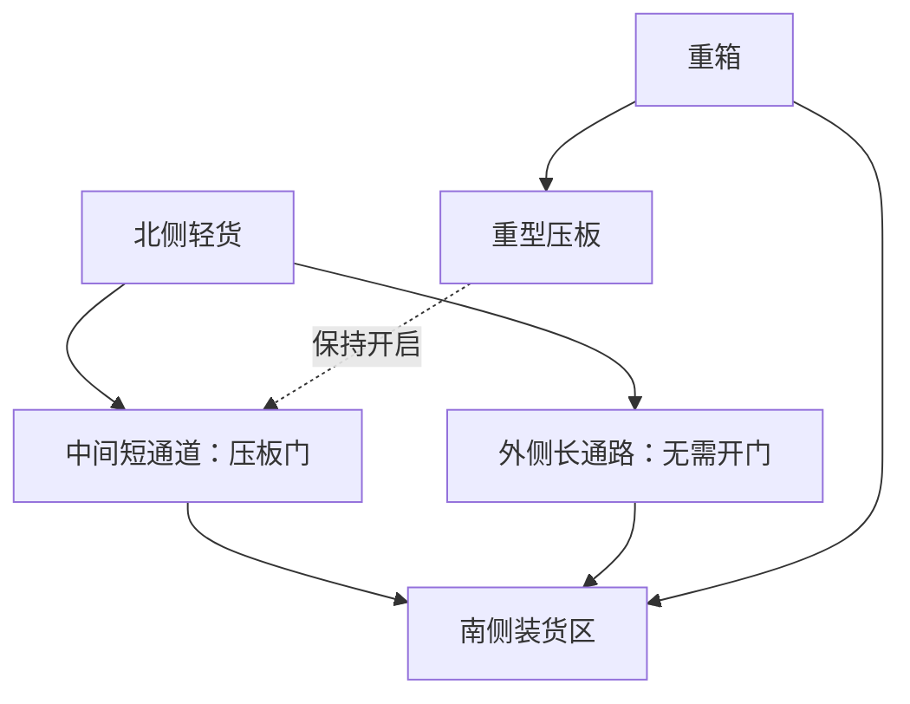

# Poki 新游戏设计：《钩子搬运工》

> 版本：0.1 · 2026-09-17  
> 状态：用户已在手机上通过三关，反馈“只要点一点就能过关”、缺少乐趣，偏好王者荣耀式实时对抗。暂停扩关，先重新评估核心方向；下文扩展计划不代表已决定继续制作。反馈和证据见 [试玩记录](HOOK_MOVER_PLAYTEST.md)。  
> 适用范围：新的游戏方向。首页为新原型，原《拖车大逃亡》保留在 /convoy，《车队劫持》文档保留为历史方案。  
> 配套文件：[首轮原型与试玩计划](HOOK_MOVER_PROTOTYPE.md)

最新偏好与约束：用户喜欢真人博弈、队友配合、输赢和段位，同时明确不打算投入服务器。后续按浏览器本地运行、无自建游戏服务器投入筛选方向，撤下在线对战与匹配候选。喜爱 MOBA 不等于新项目必须复制其体验；下一轮需重新验证用户认可的本地游戏乐趣，尚未开始新原型。

## 1. 这次真正要解决的问题

目标是做一个值得反复玩的 Poki 游戏，手机优先，同时适配桌面和平板。开发条件是单人、AI 辅助、业余投入半年到一年。

最新意图已经放开了探索、收集、升级、建设、剧情和跨多次游玩的要求。它们都可以选，也都可以不选。设计不能为了满足旧的类型标签，继续拼接系统。

本次优先判断：最基本的操作是否有趣；几个规则能否相互影响，产生不同解法；少量内容是否能验证价值。Poki 官方也明确看重逐步展开的深度和重玩价值，并没有要求所有游戏必须做成固定时长的小局。平台适合程度仍需实测。[官方选品说明](https://developers.poki.com/guide/what-we-look-for)

## 2. 筛选记录与推荐理由

下表是设计判断，不是市场评分，也不是证明某种玩法没有竞争。

| 候选 | 玩家真正反复做什么 | 有趣的潜力 | 当前主要问题 | 本次决定 |
| --- | --- | --- | --- | --- |
| 钩子搬运工 | 钩住物体，控制牵引，把货物既当工具又当交付物 | 同一操作同时改变人物位置、货物位置和通路；结果可以直观看懂 | 只靠钩索移动可能很麻烦，物理手感也有成本 | 优先做小原型 |
| 撞阵 | 弹射自己，改变敌人位置，借敌人预告攻击清场 | 单指操作与位置战术可以结合 | 弹射战斗已有接近产品；可预测碰撞与技能平衡工作多 | 保留为备选 |
| 挪动街区 | 滑动整行道路，车辆随街区移动，再统一前进 | 一步影响多辆车，解法有相互牵制 | 新手理解负担和关卡设计成本较高 | 本轮不展开 |
| 拆借机器、修复据点 | 把有限模块装到不同设施上 | 探索与据点有实际联系 | 核心容易退化为搬钥匙，需要更多区域内容支撑 | 随最新开放需求暂时搁置 |

《撞阵》的近邻包括 [Flick Shot Rogues](https://noodlecake.com/games/flick-shot-rogues/)，其官方描述就是瞄准并弹射英雄穿过棋盘的地牢玩法。因此不能把“弹射加成长”当作新意。

选择《钩子搬运工》，主要因为它可以在少量物体和一个小场景里直接验证操作、思考和意外结果。这个推荐不是全年制作承诺；若原型显示玩家一直在费力挪位置，就应改操作或撤回方向。

## 3. 一句话、画面与情绪

**你是一台小搬运机器人，用一根钩索拉货物，也借重物把自己拉过去；先让货物帮你开路，再把它们送进装货区。**

画面采用俯视 2D 玩具工场：小机器人、一条有张力的钩索、夸张但轮廓清楚的箱子与机器。场地完整放在一屏内。第一版不做自由镜头、跳跃或三维高度。

希望出现的情绪是：

1. “我想拉那个大箱子，结果自己先过去了。”
2. “那我能不能把它放在这里，当下一次移动的支点？”
3. “原来这个箱子先压门，搬完里面的东西，再一起装车就行。”
4. “刚才太绕了，我想换个顺序再试一次。”

其中第 2、3 项必须在试玩里出现。只有第 1 项的滑稽动画，撑不起完整游戏。

## 4. 四条基础规则

### 4.1 一次只连接一个目标

按住可见、够得着的目标，发射并收紧钩索；松手立即脱钩。人物和货物会在短暂惯性后停下。固定锚点附近有减速，避免移动一次就撞来撞去。

钩索是一段直线，不绕柱、不穿墙；目标离开可达范围或连接被墙挡住时，明显提示并断开。没有多根绳、绳结或真实绳索模拟。不能隔着其他实体直接钩到后面的物体。

门洞有机器人或货物时暂缓关门，避免夹住或弹飞实体。门完全关闭后若隔断钩索，钩索断开。绳线自身不推动第三件物体；门和绳的行为不能依赖临时碰撞偶然决定。

### 4.2 轻重影响双方如何移动

轻货物主要向机器人靠近；重货物使机器人移动更多；固定锚点只改变机器人位置。轻重是相对关系，普通货物和机器人通常都会动，不能把它实现为两种互不关联的播放动画。

使用有限质量档位与受控速度，让玩家可预判。质量用体量、底座和重量图标共同表达；不要求玩家读数字计算。原型调参只比较“轻货、重货、固定点”，后续才考虑更多品类。

重物主要把人拉过去，也意味着它不适合长距离反复拖。初版由轻货承担主要运输，重箱只在机关和邻近装货区之间局部挪动；开发者验证应能在两次有效牵引内完成该局部转移。若必须反复“拉一点、回到远处、再拉一点”，这一布局不予采用。远距离重货不是首发前提。

### 4.3 同一物体可以有多个用途

货物首先是场内实体，可以影响通路和机关，最后才是交付目标。

| 实体或机关 | 第一个用途 | 能产生的新判断 | 引入阶段 |
| --- | --- | --- | --- |
| 轻箱 | 搬到装货区 | 比重箱容易调整，但不能触发重型压板 | 原型 |
| 重箱 | 搬到装货区 | 临时支点、压住重型压板；动它会改变后续操作 | 原型 |
| 固定锚点 | 把机器人拉过去 | 换到货物另一侧，决定牵引方向 | 原型 |
| 压板与门 | 重物压住时开门 | 暂时留住重箱，先搬另一件货 | 原型最后一个房间 |
| 易损货物 | 完整交付 | 快速牵引与安全减速之间的选择 | 完整小样可选加入 |
| 软隔板 | 挡路 | 可用重物撞开一条捷径；只做完整/损坏两个状态 | 原型通过后 |
| 传送带 | 改变场内物体的位置 | 借运输方向完成转移，也可能让暂存物离开压板 | 最后一类扩展机关 |

不把这些扩展一次塞进原型。先证明轻重、位置、压板就能形成不同判断。

### 4.4 交付保留调整空间

装货区是一块地面区域，货物放进去后仍是实体，仍可被钩出来使用。区域内提高阻尼以便停稳，但不锁住货物，也不自动吞掉工具。

所有必需货物完整处于区域内、停稳且脱钩后，“装车”按钮才可用。点装车完成本关。提前放入一件货不提前发钱、不复制奖励；拿出来后清单状态同步变化。

每关最多 3 件必需货物。装货区必须能宽松容纳全部货物，并留出操作通路。交货本身不能变成反复排列像素的装箱难题。

## 5. 操作、镜头与容错

| 项目 | 初版约定 |
| --- | --- |
| 手机 | 单指按住目标拉，松手脱钩；不加虚拟摇杆 |
| 桌面 | 鼠标按住目标拉，松开脱钩；Esc 暂停，Z 撤销，R 重置 |
| 选中目标 | 按下时锁定目标，拖动手指不自动切换；指针取消、离开应用、失焦立即结束牵引 |
| 命中辅助 | 放大可点区域，但以可见、未遮挡目标为准；重叠时优先最近表面，不选墙后的货物 |
| 信息反馈 | 目标描边、钩索连线、双方运动方向小箭头；无效目标不给假拉动反馈 |
| 镜头 | 单屏、无跟随滚动；手机竖屏优先，横屏与桌面重新排布 HUD，保持世界比例 |
| 常驻 UI | 当前货物清单、撤销、暂停；重置放在暂停面板，装车条件满足时显示按钮 |
| 撤销 | 恢复上一次有效发钩前的整个场景状态；本关可连续撤销，无广告与次数收费 |

点住固定锚点换边，再拉货物，是基本移动方式。每个主要操作区都必须存在不依赖移动货物的固定回程路线；转角和关键货物的两侧留足调整空间。

**单指只钩是待验证的输入假设，不是必须保住的卖点。** 若玩家大部分时间用于调整站位，后备方案是“点空地移动，按住物体牵引”的顺序单指控制。后备方案单独对照试玩，不同时给两套输入让玩家猜。

纯钩索无法保证任意乱摆状态都自然可解。无效角落的几何修正、完整撤销、免费重置是基本保障，不能靠付费提示或广告复活修补。

## 6. 第一次进入：先让玩家完成一件有意思的事

时间是内部设计目标，需根据实测调整，不是 Poki 的硬性规则。

| 首次体验阶段 | 玩家看到与做到的事情 | 验证什么 |
| --- | --- | --- |
| 前 15 秒 | 机器人已经在装货区旁，眼前只有一个轻箱；短手势提示按住它，把箱子拉进区域 | 无长菜单也能开始操作 |
| 约 15–45 秒 | 装车完成一个极短练习；下一间看见重箱与固定锚点，拉重箱时自己也明显移动 | 能看懂轻重关系 |
| 约 45–120 秒 | 利用两侧固定点换位，把货物绕过宽障碍；错误可撤销 | 换边是否自然，是否一直误钩 |
| 约 2–5 分钟 | 同一重箱先用于压板，再完成交货；同时给可行但更绕的外侧路线 | 玩家会不会主动复用物体 |
| 之后 | 展示少量可选择的新委托，允许继续，也允许结束 | 下一关的变化是否令人想试 |

不以强制停留或固定倒计时制造时长。玩家可以一次完成多关，也可以结束后回来；本关暂停和存档只是便利功能。

## 7. 一份完整委托：先用，后搬

场景为一间小仓库：南侧是装货区；北侧有一件轻货；中间的短通道受压板门控制；外侧有一条更宽、更长的通路。一只重箱在压板附近，压板紧邻装货区，搬重箱只需很短的局部位移。所有路线的转角都有固定锚点，压板的投影和门明确相连。

这张图只说明通路关系，不是可直接施工的尺寸图；实际几何必须在灰盒关卡验证。

**解法 A：先留住重箱。** 把重箱压在压板上，借门南侧的固定锚点调整站位，让人物处于轻货靠装货区的一侧，再把轻货沿打开的短通道拉向装货区，最后搬入重箱。灰盒必须验证该站位、牵引距离和直线连接确实可达。门可以关上，因为剩余货物已在南侧。

**解法 B：先腾出空间。** 把重箱先放进装货区，轻货沿外侧长通路搬运。操作更长，但不必维持压板状态，而且货物空间更宽松。若重箱没放好挡住装货口，可以再拉出来调整。

两条路线都无需极限时机或刚好擦过碰撞边缘。新手追求顺利装车；熟练玩家可以优化顺序和换位次数。两条路线必须在试玩中都有人愿意选择，否则只是名义上的多解。

### 后续三个委托示例

| 委托 | 同样的钩索产生什么新问题 | 能接受的不同做法 |
| --- | --- | --- |
| 狭道换边 | 重箱挡住直接路线，但也是可移动的支点 | 先挪箱腾地；或从宽侧换位牵引 |
| 轻拿轻放 | 把易损货物绕过墙角，重物可撞开软隔板 | 留重物开短路；或完整走宽长路 |
| 传送带仓库 | 松手后货物还会被带走，停放位置有后果 | 用传送带运货再接力；或走静止地面分次牵引 |

后两个委托属于原型通过后的内容方向。它们不能成为首轮不好玩的补救借口。

## 8. 深度与重玩从哪里来

最小决策单位不是“这箱子值多少钱”，而是“我站在哪边、先动哪件东西、它动了以后会不会堵住后面的操作”。

深度按以下顺序展开：

1. **控制结果：**决定何时松手、把货物停在哪里。
2. **改变牵引方向：**先换人物位置，还是先挪挡路物。
3. **安排用途顺序：**同一货物先当机关重物、再当交付物。
4. **权衡路线：**短路线操作要求高；宽路线更容易调整。
5. **改善方案：**第一次完成后，可选挑战更少有效牵引次数或完整交付易损货物。

挑战不挡主线，不强迫攒星。完整小样只验证一种挑战条件；若没人想重玩，就按有结尾的关卡作品评估，不把“无限耐玩”写成事实。

首发不依赖货币升级、攻击力、签到、体力、掉落稀有度或反复刷材料。关卡解锁用通关推进，遇到困难可暂时跳过一关；章末委托考已学会的规则组合。没有角色养成也应能成立。

## 9. 最近的竞品与差异假设

以下事实来自官方产品页，检索日期为 2026-09-17。相似性和选择建议是本项目判断，不代表实际玩过或测过竞品。

| 近邻 | 官方页面描述的体验 | 对本设计的提醒 |
| --- | --- | --- |
| [Swingo](https://poki.com/en/g/swingo) | 角色只用钩索移动，摆动和弹跳后到达水果；支持手机与桌面 | 单指钩索移动已经成立于别的产品，不能作为本项目独创点 |
| [Grapple Grip](https://poki.com/en/g/grapple-grip) | 钩平台、攀升、解空间谜题到达出口 | 钩索加解谜也不是充分差异 |
| [Moving Out](https://store.steampowered.com/app/996770/Moving_Out/) | 物理搬家、抛掷和创意搬运路线，可单人或合作 | 不应以场景规模、多人混乱或家具数量去竞争 |

**本项目的差异假设：同一根钩索同时调动人和货物；货物的位置、临时用途与交付顺序构成主要挑战。**

如果前几个房间体现不出这一点，或者玩家只感受到“多带了个箱子的钩索闯关”，差异假设就没有成立。没有在产品简介看到某项功能，不等于竞品没有它；后续立项仍需亲自对照试玩。

## 10. 半年到一年的制作边界

每周投入尚未确认，暂按 **8–12 小时/周**估算：半年约 208–312 小时，一年约 416–624 小时。以下为投入上限建议，不是交付保证；约四分之一至三分之一总工时应覆盖返工、设备适配、声音、引导、存档与发布。

| 阶段 | 建议投入 | 交付与继续条件 |
| --- | --- | --- |
| 核心原型 | 20–35 小时，包含第一轮观察 | 3 个灰盒房间；操作与物体复用成立才继续 |
| 完整小样 | 再投入 50–80 小时 | 6 份短委托、正式视觉样张、手机输入、撤销、保存与恢复 |
| 半年小版本 | 依据实际剩余预算 | 目标上限 12 个布局、2 个场景主题、3 类货物、压板与软隔板；有结尾 |
| 一年候选首发版 | 小样后重新估算 | 目标上限 18 个布局、3 个场景主题、3 类货物、压板/软隔板/传送带；不超过 6 份复用布局的额外委托 |

以上数量是总量，不按阶段累加。6 份小样委托可以进入正式版。若质量预算不足，先砍第三主题和额外委托。

单份普通委托约 2–4 分钟只是早期节奏假设，教学更短，复杂委托可能更长。18 个布局并不自然等于数小时游戏；不承诺固定总时长，也不加重复劳动补时长。

制作一份新委托要记录：白盒搭建、验证两种方法、移动端可读性、反馈修改分别花多久。如果每个有趣关卡都需要新机关，就停止扩张并重新评估规则。

**首发排除：**联网合作、开放世界、战斗 AI、自由建造、长剧情、随机无限地图、装备词条、自由绳索缠绕、复杂刚体堆叠、连续破碎、关卡编辑器对外发布。美术最多一名主角，少量共用部件，通过场地组合变化。

## 11. 技术、美术和声音方案

推荐沿用熟悉的 **Phaser + TypeScript** 做 2D 原型，现有仓库已经有 Phaser 与 Vite 相关构建。新玩法另设模块或独立原型入口，原有拖车模拟不作为新规则的宿主；具体目录在实现时确定。规划阶段不更换构建栈。

物理原型先比较可控牵引与碰撞是否稳定。可以评估 Phaser 的 Matter 集成，但不把物理引擎当作手感保证。固定模拟步长、限制最大速度与力；用简单碰撞体，第一版限制自转与叠堆，只保留清楚的平面位移。不要把全套真实物理做成前置工程。

| 边界 | 负责什么 |
| --- | --- |
| 场景状态与规则 | 实体位置/速度/质量档、门板状态、装货判定、撤销快照、关卡进度 |
| 输入层 | 选择目标、开始/结束牵引、撤销、暂停、装车；指针中断处理 |
| 显示层 | 精灵、绳线、目标描边、粒子、音效；不独占规则状态 |
| DOM 界面 | 货物清单、暂停、语言/声音选项、委托选择、结算 |
| 资源表 | 用稳定标识组织角色、货物、环境、声音，按场景加载 |

美术选清楚的玩具工场风格，装饰不能伪装成可钩物。固定点、轻货、重货、易损货在轮廓与图标上有区别，不单靠颜色。先做一个场景的视觉样张，再复用尺寸、光照方向与描边规范生产素材。

声音优先覆盖挂钩命中、收索受力、轻/重碰撞、压板与门、交付完成。第一次视觉完成度来自这些反馈与顺畅操作，不来自大量角色皮肤。

项目内部性能目标：中档手机顺畅操作，优先稳定 60 fps；另在较低性能设备检查输入和碰撞不会随帧率变坏。首玩所需压缩资源暂以 5 MB 为预算目标，实际按加载测量调整。这不是 Poki 发布的统一包体上限。

## 12. Poki、保存与广告

平台信息于 2026-09-17 核实，正式提交前复核。

| 事项 | 本项目的安排 | 信息性质与来源 |
| --- | --- | --- |
| 设备 | 手机竖屏优先；横屏、平板和桌面都能完整操作；适配官方桌面 16:9 画布 | 官方要求：[Requirements](https://developers.poki.com/guide/requirements-quality) |
| 加载与外部资源 | 首个练习所需素材先加载，其余分批；字体、素材、依赖随包 | 官方资源政策：[External resources](https://developers.poki.com/guide/external-resources-policy) |
| 存储异常 | 本地存档失败仍能玩，简洁说明本次进度无法持久保存 | 官方要求：[Requirements](https://developers.poki.com/guide/requirements-quality) |
| 保存内容 | 通关、选项、最近关卡与最近稳定场景；存档有版本号，渲染对象不写入 | 项目设计 |
| 云存档 | 登录用户可使用 SDK 的 localStorage/IndexedDB 自动同步；压缩后有 1 MB 上限。不把自建账号当作前提 | 官方功能：[User Accounts](https://developers.poki.com/guide/accounts) |
| 生命周期 | 加载完成、首次玩家输入、暂停/结算、恢复分别管理 SDK 事件；后台冻结模拟并清除按住状态 | 官方接入：[SDK overview](https://developers.poki.com/guide/sdk-overview) |
| SDK 容错 | SDK 初始化失败继续加载；广告期间冻结输入并静音；广告结束或无填充恢复原状态 | 官方示例：[HTML5 SDK](https://developers.poki.com/guide/sdk-html5) |
| 广告位置 | 玩家从结算选择下一关、准备恢复游玩时提供商业广告机会。具体是否展示交给 SDK | 官方时机：[SDK overview](https://developers.poki.com/guide/sdk-overview) |
| 初版变现 | 先仅规划商业广告；不让广告决定撤销、重试、跳关或主线可玩性，不自行设广告倒计时 | 平台要求与项目取舍：[Requirements](https://developers.poki.com/guide/requirements-quality) |

保存以关内“松手且场景稳定”的状态为边界；进后台来不及稳定时保存最近稳定快照，恢复时提示已回到上一步。传送带阶段增加手动暂停快照，避免因为场景持续移动而长时间无法保存。退出后最多回退到明确的保存点，不能承诺每帧精确续玩。本关完整撤销历史留在内存；重新加载后从保存快照继续，不恢复更早撤销历史。

平台验证路线：上传合适原型并做 Inspector 检查，观察真实试玩录像，再推进 Player Fit、Web Fit 和最终审核。[上传流程](https://developers.poki.com/guide/adding-your-game)

当前 Player Fit 官方描述为 500 位玩家；查看至少 10 条试玩录像后解锁。推进条件为平均游玩超过 3 分钟，且至少 25% 的游玩超过 3 分钟。这是测试阶段的标准，不是正式上线保证，更不是要把每关强制拉长到 3 分钟。[Player Fit Test](https://developers.poki.com/guide/player-fit-test)

## 13. 何时应该继续，何时应该改

最先要回答的三件事：

1. 单指钩索是否比“走过去再搬”带来更有趣的选择？
2. 玩家是否会主动把货物当工具，而非只沿着提示拖去终点？
3. 不加新机关时，换一个布局能否产生值得尝试的新方法？

第一轮只做 3 个房间，不做长期养成。第二轮只针对发现的具体问题改一次，例如减少无用换位、扩大选中区域、调整重物速度；若问题明确来自纯钩索移动，就把第二轮用于对照测试点空地移动。两轮后仍未证明核心有趣，则撤回方向。任何第三轮实验都需重新说明假设与估算，不能自动追加投入。

如果你本人试玩后仍然只觉得“能玩，但不想再玩”，这也是停止投入的有效信号。不能用已经写了多少文档、做了多少素材来证明方向值得继续。

具体原型范围、观察表和下一步决策见 [首轮原型与试玩计划](HOOK_MOVER_PROTOTYPE.md)。
